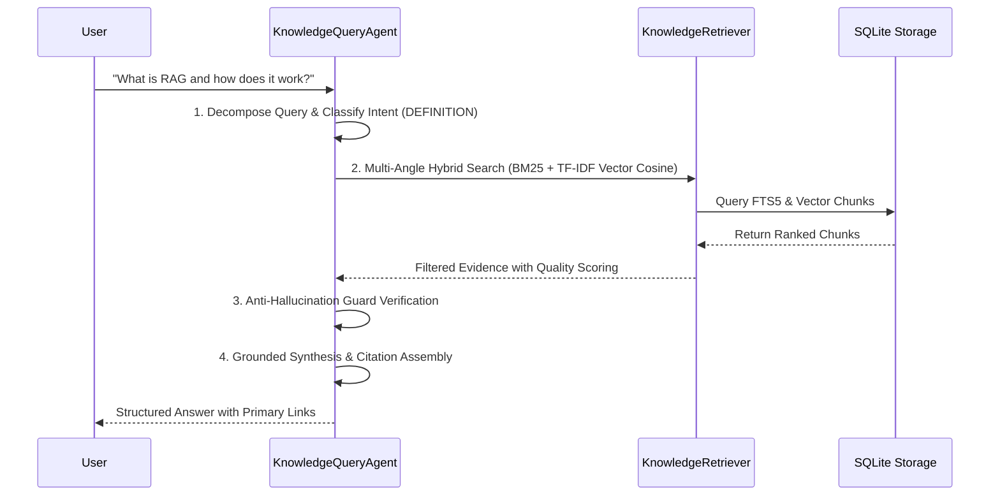

# Knowledge Search & Documentation Ingestion Skill

A comprehensive workflow guide for querying the local Knowledge Agent, executing hybrid RAG retrieval, managing the SQLite knowledge store, and dynamically ingesting web documentation.

---

## 1. Core Capabilities & Tool Matrix

| Task | MCP Tool | CLI Command | REST API Endpoint |
| :--- | :--- | :--- | :--- |
| **Agent Question Answering** | `query_knowledge_agent` | `python cli.py query "<question>"` | `POST /api/chat` |
| **Granular Chunk Search** | `search_knowledge_base` | `python cli.py query "<query>" --show-prompt` | `POST /api/search` |
| **Document Content Inspection** | `get_document` | `python cli.py query "<url>"` | `GET /api/documents/detail` |
| **List Knowledge Sources** | `list_knowledge_sources` | `python cli.py list` | `GET /api/documents` |
| **Ingest New Documentation** | `ingest_url` | `python cli.py ingest "<url>"` | `POST /api/ingest` |
| **Delete Document** | *(storage method)* | `python cli.py delete "<url>"` | `DELETE /api/documents` |

---

## 2. Multi-Stage Query Workflow

When answering technical questions about indexed systems:

### Step-by-Step Procedure:
1. **Analyze Intent**:
   - Classify as `DEFINITION`, `WORKFLOW`, `COMPARISON`, `BENEFITS`, or `TROUBLESHOOTING`.
2. **Execute Retrieval**:
   - Call `query_knowledge_agent` (or `search_knowledge_base` for raw chunks).
3. **Verify Evidence**:
   - Check that the returned section breadcrumbs directly address the core subject.
   - If no chunks match the subject terms, provide the explicit unindexed notification.
4. **Synthesize & Cite**:
   - Quote exact UI navigation paths verbatim.
   - Format primary citations with clickable markdown links `[Title](URL) (Section Path)`.

---

## 3. Dynamic URL Ingestion Workflow

To add new documentation to the knowledge base:

1. **Verify Existing Coverage**:
   - Run `python cli.py list` or call `list_knowledge_sources` to check if the URL is already indexed.
2. **Ingest & Parse**:
   - Call `ingest_url(url="https://...")` or run `python cli.py ingest "https://..."`.
   - The scraper extracts JSON-LD schemas, headers, tables, and clean Markdown.
   - The hierarchical chunker splits into semantic context-prefixed chunks with overlap.
3. **Validate Ingestion**:
   - Run a test query against the newly added topic to confirm immediate retrieval availability.

---

## 4. Troubleshooting & Error Recovery

- **Empty Database / First Run**:
  - Run `python run_server.py` or `python cli.py seed` to auto-seed default Bitbucket Cloud documentation.
- **Port Conflict (8000 already in use)**:
  - Set custom port via environment variable: `$env:PORT=8080 ; python run_server.py`.
- **Zero Hits on Known Subject**:
  - Check spelling or synonyms in `src/retriever.py` `SYNONYM_MAP`.
  - Re-ingest the URL if the remote web page changed structure.
