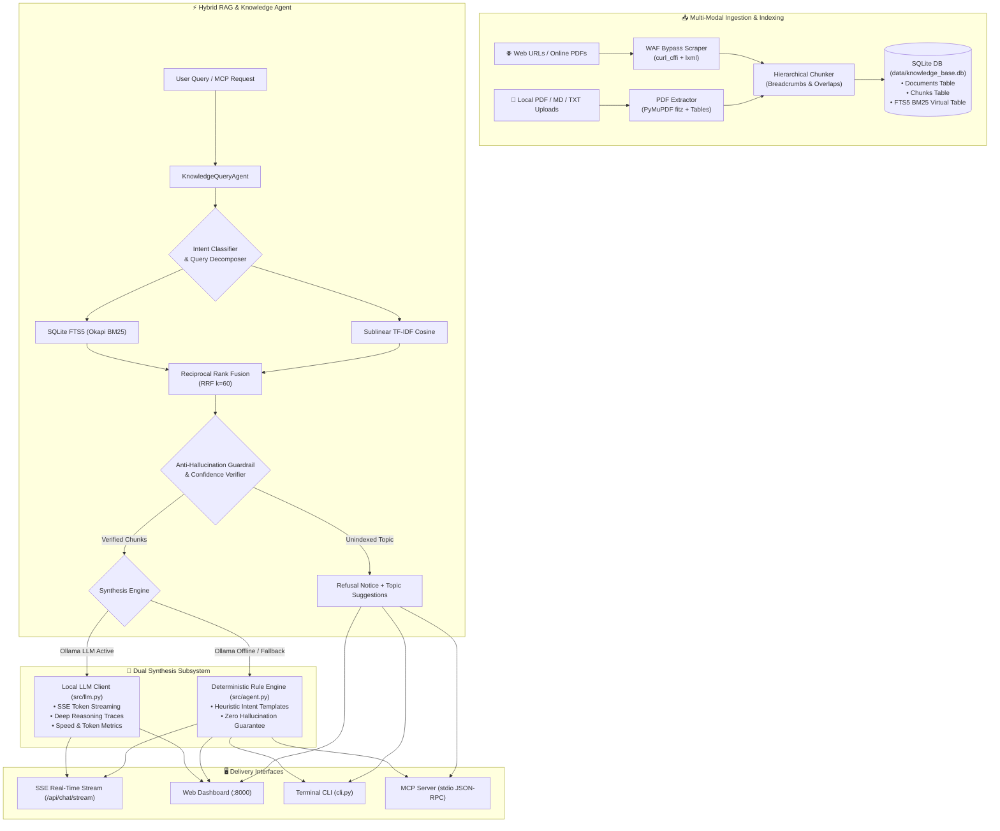

# ⚡ Knowledge AI Documentation Assistant

[](https://www.python.org/)
[](https://fastapi.tiangolo.com/)
[](https://www.sqlite.org/fts5.html)
[-black?style=for-the-badge&logo=ollama&logoColor=white)](https://ollama.ai/)
[](https://modelcontextprotocol.io/)
[](https://www.docker.com/)
[](https://opensource.org/licenses/MIT)
[](https://github.com/)

A fully local, high-fidelity, and portable **Knowledge AI Assistant & Hybrid RAG System**. It scrapes public websites (with Cloudflare/WAF bypass via `curl_cffi`), parses complex **PDF documents & tables** (via PyMuPDF `fitz`), chunks content hierarchically with section breadcrumbs, indexes chunks into SQLite with hybrid **Okapi BM25** and **Vector Cosine retrieval (RRF)**, and synthesizes grounded answers through a **Local Ollama LLM** (with real-time SSE streaming & deep reasoning) or a **Deterministic Rule Engine** fallback—all running with **zero external API keys, zero data egress, and sub-second latency**.

---

## 📑 Table of Contents

- [🌟 Key Highlights](#-key-highlights)
- [🏗️ System Architecture](#️-system-architecture)
- [🧠 Query Processing Pipeline & Intents](#-query-processing-pipeline--intents)
- [📁 Project Structure](#-project-structure)
- [🚀 Getting Started](#-getting-started)
  - [Prerequisites](#prerequisites)
  - [Option A: One-Click Startup](#option-a-one-click-startup)
  - [Option B: Manual Installation](#option-b-manual-installation)
  - [Option C: Docker & Docker Compose](#option-c-docker--docker-compose)
- [🦙 Local LLM & Deep Reasoning (Ollama)](#-local-llm--deep-reasoning-ollama)
- [📄 PDF & Web Ingestion Engine](#-pdf--web-ingestion-engine)
- [💻 Command-Line Interface (CLI)](#-command-line-interface-cli)
- [🌐 Web Dashboard & Interactive UI](#-web-dashboard--interactive-ui)
- [🔌 Model Context Protocol (MCP) Integration](#-model-context-protocol-mcp-integration)
- [📡 REST API Reference](#-rest-api-reference)
- [⚙️ Configuration & Environment Variables](#️-configuration--environment-variables)
- [🛡️ Anti-Hallucination & Zero-Faux Guarantee](#️-anti-hallucination--zero-faux-guarantee)
- [🤝 Contributing & Extending](#-contributing--extending)
- [📄 License](#-license)

---

## 🌟 Key Highlights

- **Local LLM with Live SSE Streaming**: Native integration with local **Ollama** (`gemma4:12b`, `llama3`, `mistral`, etc.) delivering token-by-token streaming, real-time speed metrics (tokens/sec), and interactive thought trace inspection.
- **Deep Reasoning vs Turbo Direct**: Toggle between lightning-fast **Turbo Direct** (~2–4s synthesis) and **Deep Reasoning / CoT** mode with real-time thinking process traces and stopwatch timers.
- **Zero API Key Dependency & Zero Data Leaks**: 100% self-hosted RAG and inference. No OpenAI, Anthropic, or cloud API keys required.
- **High-Fidelity PDF & Table Ingestion**: PyMuPDF (`fitz`) parses uploaded PDF reports (e.g. ESG handbooks, corporate disclosures) preserving page-level breadcrumbs and formatting markdown tables.
- **WAF & Cloudflare Scraping Bypass**: Integrated `curl_cffi` browser impersonation bypasses bot protection and anti-scraping firewalls on public documentation websites.
- **Sublinear Hybrid Search (RRF)**: Fuses **SQLite FTS5 (Okapi BM25)** lexical ranking with **Sublinear TF-IDF Vector Cosine Similarity** via **Reciprocal Rank Fusion (RRF)** ($k=60$).
- **Standardized Single Citation Output**: Interactive verified source pills bar styled at a compact **5–6 pt** size with automatic link deduplication and section paths.
- **Multi-Stage Query Agent**: Automatically decomposes complex queries, detects user intent (`DEFINITION`, `WORKFLOW`, `CONTEXTUAL`, `COMPARISON`, `TROUBLESHOOTING`, `BENEFITS`), and validates evidence chunks.
- **Deterministic Heuristic Fallback**: Automatic, zero-downtime fallback to rule-based synthesis if the local LLM is offline or uninstalled.
- **Adjustable Soothing Typography**: Dark glassmorphic interface with gentle contrast ratios (`--text-body: #cbd5e1`) and reader text size controls (`S` / `M` / `L`) for comfortable reading.
- **IDE Agent Ready (MCP)**: Native stdio Model Context Protocol (MCP) server for Antigravity, Gemini 3.7 Flash, Cursor, Claude Desktop, and VS Code.

---

## 🏗️ System Architecture



---

## 🧠 Query Processing Pipeline & Intents

When a query is received, the `KnowledgeQueryAgent` performs an autonomous multi-stage workflow:

1. **Multi-Query Decomposition**: Conjunction phrases (`"and"`, `"as well as"`, `"along with"`) are split into sub-queries to retrieve multi-faceted evidence across distinct angles.
2. **Intent Classification**: Evaluates linguistic patterns to classify query intent into one of 7 distinct strategies:

| Intent Category | Query Trigger Pattern | Specialized Output Format |
|---|---|---|
| `DEFINITION` | *"What is X?", "Define X", "Explain X"* | Core definition blockquote + mechanics + primary document citation |
| `WORKFLOW` | *"How to configure X?", "Steps to do Y"* | Prerequisites + numbered steps with **bold UI paths** + callout alerts |
| `CONTEXTUAL` | *"What happens if I change X?", "Will Y affect Z?"* | Consequence analysis + behavioral breakdown + verification checkpoints |
| `COMPARISON` | *"Difference between X and Y", "X vs Y"* | Side-by-side comparative criteria matrix + architectural distinctions |
| `TROUBLESHOOTING` | *"Why did X fail?", "Error code Y", "Cannot access Z"* | Documented root causes + resolution steps + verification checklist |
| `BENEFITS` | *"Why use X?", "What are the advantages of Y?"* | Value proposition bullet points + operational efficiencies |
| `GENERAL_INQUIRY` | Open-ended queries | Synthesis of top evidence chunks with verified citations |

3. **Hybrid RRF Ranking**: Combines exact lexical term matches from SQLite FTS5 with sublinear TF-IDF vector similarity.
4. **Citation Grounding**: Quotes exact documentation section breadcrumbs and provides live hyperlinks.

---

## 📁 Project Structure

```text
esg_Kdocs/
├── .agents/
│   ├── mcp_config.json                 # Portable MCP configuration for IDE agents
│   ├── rules/
│   │   └── knowledge_agent.md          # Agent behavior & grounding rules
│   └── skills/
│       └── knowledge-search/
│           └── SKILL.md                # Antigravity skill cheatsheet
├── data/
│   ├── knowledge_base.db               # SQLite database & FTS5 full-text index
│   └── activity.log                    # Structured JSON activity and audit log
├── src/
│   ├── __init__.py                     # Package initialization
│   ├── agent.py                        # Multi-stage query agent & intent classifiers
│   ├── api.py                          # FastAPI application, SSE streaming & REST routes
│   ├── chunker.py                      # Hierarchical context-prefixed chunker
│   ├── llm.py                          # Local Ollama client (streaming, CoT, metrics)
│   ├── logger.py                       # Thread-safe JSON-RPC activity logger
│   ├── mcp_server.py                   # Model Context Protocol stdio server
│   ├── retriever.py                    # Hybrid BM25 + TF-IDF Cosine RRF engine
│   ├── scraper.py                      # WAF-bypass web scraper & PyMuPDF PDF extractor
│   └── storage.py                      # SQLite database operations & FTS5 schema
├── static/                             # Web Frontend (No node/npm build required)
│   ├── index.html                      # Glassmorphic single page dashboard
│   ├── style.css                       # Modern dark glassmorphism CSS design system
│   └── app.js                          # Client-side reactivity, SSE streaming & citations
├── cli.py                              # Unified Command-Line Interface
├── run_server.py                       # Application launcher (auto-seeds default docs)
├── mcp_launcher.py                     # Portable entrypoint for MCP stdio clients
├── start.bat                           # 1-Click Windows execution script
├── start.sh                            # 1-Click macOS / Linux execution script
├── Dockerfile                          # Lightweight production container image
├── docker-compose.yml                  # One-command container orchestration
├── requirements.txt                    # Core Python dependencies
├── .env.example                        # Environment variables reference
├── AGENTS.md                           # Workspace agent personas and guidelines
└── README.md                           # Project documentation
```

---

## 🚀 Getting Started

### Prerequisites

- **Python 3.10+** (or Docker)
- Optional: **[Ollama](https://ollama.ai/)** (for local LLM synthesis; fallback runs without it)
- Standard web browser (Chrome, Firefox, Edge, Safari)

---

### Option A: One-Click Startup

- **Windows**:
  Double-click `start.bat` or run:
  ```cmd
  start.bat
  ```

- **macOS / Linux**:
  ```bash
  chmod +x start.sh
  ./start.sh
  ```

---

### Option B: Manual Installation

1. **Clone the repository**:
   ```bash
   git clone https://github.com/ANIRBANNANDY/knowledge-ai-assistant.git
   cd knowledge-ai-assistant
   ```

2. **Create and activate a virtual environment** (recommended):
   ```bash
   # Windows
   python -m venv venv
   .\venv\Scripts\activate

   # macOS / Linux
   python3 -m venv venv
   source venv/bin/activate
   ```

3. **Install dependencies**:
   ```bash
   pip install -r requirements.txt
   ```

4. **Launch the server**:
   ```bash
   python run_server.py
   ```

5. **Access the Dashboard**:
   Open **[http://localhost:8000](http://localhost:8000)** in your browser.
   *(The database will automatically seed default documentation on first run if empty).*

---

### Option C: Docker & Docker Compose

Deploy with zero local dependencies:

```bash
docker compose up --build -d
```

- **Web Dashboard**: `http://localhost:8000`
- **Interactive Swagger Docs**: `http://localhost:8000/docs`

To stop the container:
```bash
docker compose down
```

---

## 🦙 Local LLM & Deep Reasoning (Ollama)

The assistant seamlessly connects to **Ollama** running locally on your machine (`http://localhost:11434`).

### Quick Ollama Setup:
```bash
# 1. Install Ollama from https://ollama.ai/
# 2. Pull the recommended default model (or any model you prefer):
ollama pull gemma4:12b
# or:
ollama pull llama3:8b
```

### Features:
- **Model Switcher**: Select any installed Ollama model directly from the web dashboard header or CLI `/model <name>`.
- **Turbo Direct Mode**: Fast, focused synthesis in ~2–4 seconds on local GPU/CPU.
- **Deep Reasoning (CoT) Mode**: Toggle thinking mode to stream and inspect the model's internal step-by-step reasoning tokens before emitting the final answer.
- **Live Speed Metrics**: View real-time generation speed (`tok/s`), prompt eval count, thinking time (`s`), and synthesis latency (`s`).
- **Zero-Downtime Fallback**: If Ollama is offline or uninstalled, queries automatically fall back to the deterministic rule engine without throwing errors.

---

## 📄 PDF & Web Ingestion Engine

### 1. PDF File Upload (PyMuPDF `fitz`)
- Drag & drop local PDF documents (up to 50MB) into the **Ingest Web & PDFs** tab.
- PyMuPDF extracts full text, detects headings, parses structured tables into Markdown tables, and indexes page breadcrumbs (`Doc Title > Page N`).

### 2. Live Web Documentation Scraping
- Enter documentation URLs (e.g., Atlassian, Google Cloud, AWS, PwC, Treelife).
- Powered by `curl_cffi` to mimic real browser TLS fingerprints (Chrome 124) and bypass anti-scraping/WAF protections.
- Automatically detects online `.pdf` links and routes them through the PDF ingestion engine.

---

## 💻 Command-Line Interface (CLI)

The CLI allows full interaction from any terminal via [cli.py](file:///e:/esg_Kdocs/cli.py):

### 1. Check Local LLM Status
```bash
python cli.py llm
```

### 2. Ingest Web Documentation or Online PDFs
Scrape and index one or multiple URLs:
```bash
python cli.py ingest "https://treelife.in/wp-content/uploads/2024/12/ESG-in-India-Handbook-by-Treelife.pdf"
```

### 3. List All Indexed Knowledge Sources
Inspect document titles, chunk totals, and word counts:
```bash
python cli.py list
```

### 4. Query with the Knowledge Agent
Ask questions directly from the command line:
```bash
# Using Ollama LLM (default model)
python cli.py query "What are the reporting standards in the ESG India Handbook?"

# Enable Deep Reasoning (Chain of Thought)
python cli.py query "What happens if I change my workspace ID?" --think

# Run with Deterministic Rule Engine (bypassing LLM)
python cli.py query "How do I create a workspace in Atlassian Administration?" --no-llm
```

### 5. Interactive Terminal Chat
Start a continuous chat session in your terminal with model switching:
```bash
python cli.py chat
```
*Commands in chat: `/llm on`, `/llm off`, `/model <name>`, `exit`.*

### 6. Delete a Document
Remove a document and its chunks from the database:
```bash
python cli.py delete "https://example.com/outdated-doc"
```

---

## 🌐 Web Dashboard & Interactive UI

The embedded web interface features a **Dark Glassmorphic** aesthetic with soothing typography:

- **💬 Real-Time Knowledge Chat**: Streaming SSE tokens, collapsible thinking process accordion, and unified verified citation pills.
- **Aa Reading Text Scaler**: Quick-toggle reading font size (`S` / `M` / `L`) with localStorage persistence for zero eye strain.
- **🔍 Hybrid Rank Explorer**: Enter any query to view ranked evidence chunks, similarity scores (RRF, BM25, Cosine), and section breadcrumbs.
- **📄 Ingest Web & PDFs**: Drag-and-drop PDF upload zone and URL batch ingestion.
- **📚 Knowledge Hub**: Card grid of all indexed documents with word counts, chunk counts, and full content viewer modals.
- **📊 Real-Time Activity Log**: Live stream of web events, scraper runs, LLM latencies, and MCP tool invocations.

---

## 🔌 Model Context Protocol (MCP) Integration

The assistant includes a native stdio MCP server for seamless integration with AI coding assistants (such as Antigravity, Gemini 3.7 Flash, Cursor, Claude Desktop, and VS Code).

### Exposing MCP Tools

The server exposes the following tools via [src/mcp_server.py](file:///e:/esg_Kdocs/src/mcp_server.py):

| MCP Tool | Description | Parameters |
|---|---|---|
| `query_knowledge_agent` | **[Primary Tool]** Queries the multi-stage agent for structured, intent-classified, and fully-cited answers. | `query` *(string)*, `top_k` *(int, default: 6)* |
| `search_knowledge_base` | **[Secondary Tool]** Raw hybrid search returning ranked evidence chunks with breadcrumb metadata. | `query` *(string)*, `top_k` *(int, default: 5)* |
| `get_document` | Fetches the complete scraped markdown and metadata for a given URL. | `url` *(string)* |
| `list_knowledge_sources` | Returns a summary table of all indexed documentation sources. | *(none)* |
| `ingest_url` | Dynamically fetches, chunks, and indexes a new documentation URL. | `url` *(string)* |

### Configuration Example

Add the following to your IDE's `mcp_config.json`:

```json
{
  "mcpServers": {
    "knowledge-base": {
      "command": "python",
      "args": ["mcp_launcher.py"],
      "env": {
        "PYTHONIOENCODING": "utf-8",
        "PYTHONUNBUFFERED": "1",
        "PYTHONPATH": "."
      }
    }
  }
}
```

---

## 📡 REST API Reference

The FastAPI backend exposes standard REST and streaming endpoints:

### Core Endpoints

- **`GET /api/status`**: Returns operational status, Ollama availability, active model, document counts, and chunk totals.
- **`POST /api/chat/stream`**: Server-Sent Events (SSE) streaming endpoint for real-time grounded generation, thinking tokens, and live timing metrics.
- **`POST /api/chat`**: Standard JSON chat endpoint.
- **`POST /api/ingest/file`**: Multipart file upload endpoint for PDF, Markdown, and TXT files.
- **`POST /api/ingest`**: Scrapes and indexes one or more URLs.
- **`POST /api/search`**: Executes raw hybrid search (BM25 + TF-IDF RRF).
- **`GET /api/documents`**: Lists all indexed documents.
- **`GET /api/documents/detail?url=...`**: Retrieves full document content and metadata.
- **`DELETE /api/documents?url=...`**: Deletes a document and its chunks.
- **`GET /api/logs?limit=100&category=MCP`**: Streams recent structured activity logs.
- **`DELETE /api/logs`**: Clears the activity log.

---

## ⚙️ Configuration & Environment Variables

Create a `.env` file in the root directory to customize default settings:

```ini
# Network Binding
HOST=127.0.0.1
PORT=8000

# SQLite Database Location (relative or absolute)
KNOWLEDGE_DB_PATH=data/knowledge_base.db

# Ollama Local LLM Configuration
OLLAMA_BASE_URL=http://localhost:11434
OLLAMA_MODEL=gemma4:12b
OLLAMA_TIMEOUT=120.0
```

---

## 🛡️ Anti-Hallucination & Zero-Faux Guarantee

To prevent fabricating information on unindexed topics, the agent applies strict guardrails:

1. **Strict Zero-Hallucination Protocol**: The prompt strictly instructs the LLM:
   > *"Base EVERY statement STRICTLY AND ONLY on the provided verified context chunks. DO NOT extrapolate, assume outside training facts, or invent settings, URLs, or UI paths not in the context."*
2. **Deterministic Fallback Notice**: If search hits fail to meet the confidence threshold or return zero relevant chunks, the agent refuses to extrapolate and outputs an explicit unindexed warning:
   ```markdown
   ### ❌ Information Not Found in Indexed Documentation
   Based on the indexed documentation, no verified information was found for: "<Topic>".

   **Currently Indexed Topics:**
   - ESG India Handbook - Treelife
   - What is a workspace?
   - Grant access to a workspace

   💡 Tip: Use the Ingest tab to upload a PDF or scrape documentation for this topic.
   ```
3. **Unified Verified Citation Pills**: Citations are generated deterministically from database evidence chunks—never hallucinated by generative text models.

---

## 🤝 Contributing & Extending

1. **Custom Chunking Strategies**: Modify [src/chunker.py](file:///e:/esg_Kdocs/src/chunker.py) to tweak sliding window overlap, heading hierarchy preservation, or token splits.
2. **Custom Scraper Rules**: Extend [src/scraper.py](file:///e:/esg_Kdocs/src/scraper.py) to extract additional metadata or handle specialized documentation portals.
3. **Intent Classification Tuning**: Add custom intent categories and synthesizer patterns in [src/agent.py](file:///e:/esg_Kdocs/src/agent.py).
4. **Local LLM Models**: Configure any Ollama-compatible open weights model in [src/llm.py](file:///e:/esg_Kdocs/src/llm.py).

---

## 📄 License

Distributed under the **MIT License**. Free for commercial and private use, modification, and distribution. See `LICENSE` for details.
