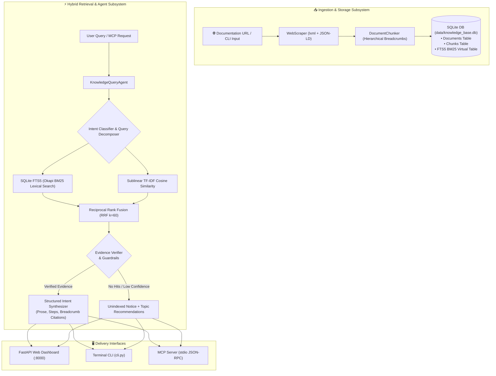

# ⚡ Knowledge AI Documentation Assistant

[](https://www.python.org/)
[](https://fastapi.tiangolo.com/)
[](https://www.sqlite.org/fts5.html)
[](https://modelcontextprotocol.io/)
[](https://www.docker.com/)
[](https://opensource.org/licenses/MIT)
[](https://github.com/)

A fully local, lightning-fast, and portable Knowledge AI Assistant and Hybrid RAG system. It dynamically scrapes online documentation, parses structured content with hierarchical context breadcrumbs, indexes chunks into SQLite with hybrid Okapi BM25 and Vector Cosine retrieval, and synthesizes answers through a **Deterministic Multi-Stage Knowledge Query Agent** and a **Model Context Protocol (MCP)** server—all running with **zero external API keys and sub-20ms latency**.

---

## 📑 Table of Contents

- [🌟 Key Highlights](#-key-highlights)
- [🏗️ System Architecture](#️-system-architecture)
- [🧠 Query Processing Pipeline & Intents](#-query-processing-pipeline--intents)
- [📁 Project Structure](#-project-structure)
- [🚀 Getting Started](#-getting-started)
  - [Prerequisites](#prerequisites)
  - [Option A: One-Click Startup](#option-a-one-click-startup)
  - [Option B: Manual Installation](#option-b-manual-installation)
  - [Option C: Docker & Docker Compose](#option-c-docker--docker-compose)
- [💻 Command-Line Interface (CLI)](#-command-line-interface-cli)
- [🌐 Web Dashboard & Interactive UI](#-web-dashboard--interactive-ui)
- [🔌 Model Context Protocol (MCP) Integration](#-model-context-protocol-mcp-integration)
- [📡 REST API Reference](#-rest-api-reference)
- [⚙️ Configuration & Environment Variables](#️-configuration--environment-variables)
- [🛡️ Anti-Hallucination & Zero-Faux Guarantee](#️-anti-hallucination--zero-faux-guarantee)
- [🤝 Contributing & Extending](#-contributing--extending)
- [📄 License](#-license)

---

## 🌟 Key Highlights

- **100% Dynamic & Portable**: Auto-resolves project paths, databases, logs, and relative imports across **Windows**, **macOS**, **Linux**, and **Docker** with no machine-specific absolute paths.
- **Zero API Key Dependency**: Fully functional offline/local retrieval and synthesis without OpenAI, Anthropic, or external embedding API subscriptions.
- **Sublinear Hybrid Search (RRF)**: Merges **SQLite FTS5 (Okapi BM25)** full-text lexical ranking with **Sublinear TF-IDF Vector Cosine Similarity** using **Reciprocal Rank Fusion (RRF)** ($k=60$).
- **Multi-Stage Query Agent**: Automatically decomposes complex queries, detects user intent (`DEFINITION`, `WORKFLOW`, `CONTEXTUAL`, `COMPARISON`, `TROUBLESHOOTING`, `BENEFITS`), synthesizes step-by-step procedures, and generates verbatim URL citations.
- **Strict Anti-Hallucination Guardrails**: Detects unindexed topics and informs the user of known topics rather than fabricating configurations or non-existent URLs.
- **Real-Time Dynamic Web Ingestion**: Live scraping engine extracting headings, JSON-LD metadata, clean markdown, and hierarchical breadcrumb chunking.
- **IDE Agent Ready (MCP)**: Native stdio Model Context Protocol (MCP) server for Antigravity, Cursor, Claude Desktop, and VS Code.
- **Glassmorphic Modern UI**: Responsive dark dashboard with chat interface, search rank inspector, live activity stream, and document manager.

---

## 🏗️ System Architecture



---

## 🧠 Query Processing Pipeline & Intents

When a query is received, the `KnowledgeQueryAgent` performs an autonomous multi-stage workflow:

1. **Multi-Query Decomposition**: Conjunction phrases (`"and"`, `"as well as"`, `"along with"`) are split into sub-queries to retrieve multi-faceted evidence.
2. **Intent Classification**: Evaluates linguistic patterns to classify query intent into one of 7 distinct strategies:

| Intent Category | Query Trigger Pattern | Specialized Output Format |
|---|---|---|
| `DEFINITION` | *"What is X?", "Define X", "Explain X"* | Core definition blockquote + mechanics + primary document citation |
| `WORKFLOW` | *"How to configure X?", "Steps to do Y"* | Prerequisites + numbered steps with **bold UI paths** + callout alerts |
| `CONTEXTUAL` | *"What happens if I change X?", "Will Y affect Z?"* | Consequence analysis + behavioral breakdown + verification checkpoints |
| `COMPARISON` | *"Difference between X and Y", "X vs Y"* | Side-by-side comparative criteria matrix + architectural distinctions |
| `TROUBLESHOOTING` | *"Why did X fail?", "Error code Y", "Cannot access Z"* | Documented root causes + resolution steps + verification checklist |
| `BENEFITS` | *"Why use X?", "What are the advantages of Y?"* | Value proposition bullet points + operational efficiencies |
| `GENERAL_INQUIRY` | Open-ended queries | Synthesis of top evidence chunks with verified citations |

3. **Hybrid RRF Ranking**: Combines exact lexical term matches from SQLite FTS5 with sublinear TF-IDF vector similarity.
4. **Citation Grounding**: Quotes exact documentation section breadcrumbs and provides live hyperlinks.

---

## 📁 Project Structure

```text
esg_Kdocs/
├── .agents/
│   ├── mcp_config.json                 # Portable MCP configuration for IDE agents
│   ├── rules/
│   │   └── knowledge_agent.md          # Agent behavior & grounding rules
│   ├── skills/
│   │   └── knowledge-search/
│   │       └── SKILL.md                # Antigravity skill cheatsheet
│   └── plugins/
│       └── knowledge-base/             # Namespaced agent plugin bundle
├── data/
│   ├── knowledge_base.db               # SQLite database & FTS5 full-text index
│   └── activity.log                    # Structured JSON activity and audit log
├── src/
│   ├── __init__.py                     # Package initialization
│   ├── agent.py                        # Multi-stage query agent & intent classifiers
│   ├── scraper.py                      # High-fidelity web scraper & DOM cleaner
│   ├── chunker.py                      # Hierarchical context-prefixed chunker
│   ├── storage.py                      # SQLite database operations & FTS5 schema
│   ├── retriever.py                    # Hybrid BM25 + TF-IDF Cosine RRF engine
│   ├── mcp_server.py                   # Model Context Protocol stdio server
│   ├── logger.py                       # Thread-safe JSON-RPC activity logger
│   └── api.py                          # FastAPI application & static mount
├── static/                             # Web Frontend (No node/npm build required)
│   ├── index.html                      # Glassmorphic single page dashboard
│   ├── style.css                       # Modern dark glassmorphism CSS design system
│   └── app.js                          # Client-side reactivity, search & live log polling
├── cli.py                              # Unified Command-Line Interface
├── run_server.py                       # Application launcher (auto-seeds default docs)
├── mcp_launcher.py                     # Portable entrypoint for MCP stdio clients
├── start.bat                           # 1-Click Windows execution script
├── start.sh                            # 1-Click macOS / Linux execution script
├── Dockerfile                          # Lightweight production container image
├── docker-compose.yml                  # One-command container orchestration
├── requirements.txt                    # Core Python dependencies
├── .env.example                        # Environment variables reference
├── AGENTS.md                           # Workspace agent personas and guidelines
└── README.md                           # Project documentation
```

---

## 🚀 Getting Started

### Prerequisites

- **Python 3.10+** (or Docker)
- Standard web browser (Chrome, Firefox, Edge, Safari)

---

### Option A: One-Click Startup

- **Windows**:
  Double-click `start.bat` or run:
  ```cmd
  start.bat
  ```

- **macOS / Linux**:
  ```bash
  chmod +x start.sh
  ./start.sh
  ```

---

### Option B: Manual Installation

1. **Clone the repository**:
   ```bash
   git clone https://github.com/your-repo/knowledge-ai-chatbot.git
   cd knowledge-ai-chatbot
   ```

2. **Create and activate a virtual environment** (recommended):
   ```bash
   # Windows
   python -m venv venv
   .\venv\Scripts\activate

   # macOS / Linux
   python3 -m venv venv
   source venv/bin/activate
   ```

3. **Install dependencies**:
   ```bash
   pip install -r requirements.txt
   ```

4. **Launch the server**:
   ```bash
   python run_server.py
   ```

5. **Access the Dashboard**:
   Open **[http://localhost:8000](http://localhost:8000)** in your browser.
   *(The database will automatically seed default documentation on first run if empty).*

---

### Option C: Docker & Docker Compose

Deploy with zero local dependencies:

```bash
docker compose up --build -d
```

- **Web Dashboard**: `http://localhost:8000`
- **Interactive Swagger Docs**: `http://localhost:8000/docs`

To stop the container:
```bash
docker compose down
```

---

## 💻 Command-Line Interface (CLI)

The CLI allows full interaction from any terminal via [cli.py](file:///e:/esg_Kdocs/cli.py):

### 1. Ingest Web Documentation
Scrape and index one or multiple URLs:
```bash
python cli.py ingest "https://docs.github.com/en/get-started/start-your-journey/about-github-and-git"
```

### 2. Seed Default Knowledge Base
Quickly load core Bitbucket Cloud documentation:
```bash
python cli.py seed
```

### 3. List All Indexed Knowledge Sources
Inspect document titles, chunk totals, and word counts:
```bash
python cli.py list
```

### 4. Query with the Knowledge Agent
Ask questions directly from the command line:
```bash
python cli.py query "How to grant access to a workspace?"
```

Display the full grounded prompt fed to the agent:
```bash
python cli.py query "What is a workspace?" --show-prompt
```

### 5. Interactive Terminal Chat
Start a continuous chat session in your terminal:
```bash
python cli.py chat
```

### 6. Delete a Document
Remove a document and its chunks from the database:
```bash
python cli.py delete "https://example.com/outdated-doc"
```

---

## 🌐 Web Dashboard & Interactive UI

The embedded web interface features a **Dark Glassmorphic** aesthetic:

- **💬 Real-Time Knowledge Chat**: Chat directly with the Multi-Stage Knowledge Agent.
- **🔍 Hybrid Rank Explorer**: Enter any query to view ranked evidence chunks, similarity scores, and section breadcrumbs.
- **📥 Live Web Ingestion Modal**: Paste any documentation URL to scrape and index it in real-time.
- **📊 Real-Time Activity Log**: Live stream of web events, scraper runs, and MCP tool invocations with millisecond latency metrics.
- **📚 Knowledge Source Directory**: View, inspect, or delete indexed documentation.

---

## 🔌 Model Context Protocol (MCP) Integration

The assistant includes a native stdio MCP server for seamless integration with AI coding assistants (such as Antigravity, Cursor, Claude Desktop, and VS Code).

### Exposing MCP Tools

The server exposes the following tools via [src/mcp_server.py](file:///e:/esg_Kdocs/src/mcp_server.py):

| MCP Tool | Description | Parameters |
|---|---|---|
| `query_knowledge_agent` | **[Primary Tool]** Queries the multi-stage agent for structured, intent-classified, and fully-cited answers. | `query` *(string)*, `top_k` *(int, default: 6)* |
| `search_knowledge_base` | **[Secondary Tool]** Raw hybrid search returning ranked evidence chunks with breadcrumb metadata. | `query` *(string)*, `top_k` *(int, default: 5)* |
| `get_document` | Fetches the complete scraped markdown and metadata for a given URL. | `url` *(string)* |
| `list_knowledge_sources` | Returns a summary table of all indexed documentation sources. | *(none)* |
| `ingest_url` | Dynamically fetches, chunks, and indexes a new documentation URL. | `url` *(string)* |

### Configuration Example

Add the following to your IDE's `mcp_config.json`:

```json
{
  "mcpServers": {
    "knowledge-base": {
      "command": "python",
      "args": ["mcp_launcher.py"]
    }
  }
}
```

---

## 📡 REST API Reference

The FastAPI backend exposes standard REST endpoints:

### Core Endpoints

- **`GET /api/status`**: Returns operational status, document counts, chunk totals, and word counts.
- **`POST /api/chat`**: Dispatches a query to the `KnowledgeQueryAgent`.
  ```json
  {
    "message": "How do I create a Bitbucket workspace?",
    "top_k": 6
  }
  ```
- **`POST /api/search`**: Executes raw hybrid search (BM25 + TF-IDF RRF).
  ```json
  {
    "query": "workspace permissions",
    "top_k": 5
  }
  ```
- **`GET /api/documents`**: Lists all indexed documents.
- **`GET /api/documents/detail?url=...`**: Retrieves full document content and metadata.
- **`POST /api/ingest`**: Scrapes and indexes one or more URLs.
  ```json
  {
    "urls": ["https://example.com/documentation"]
  }
  ```
- **`DELETE /api/documents?url=...`**: Deletes a document and its chunks.
- **`GET /api/logs?limit=100&category=MCP`**: Streams recent structured activity logs.
- **`DELETE /api/logs`**: Clears the activity log.

---

## ⚙️ Configuration & Environment Variables

Create a `.env` file in the root directory to customize default settings:

```ini
# Network Binding
HOST=127.0.0.1
PORT=8000

# SQLite Database Location (relative or absolute)
KNOWLEDGE_DB_PATH=data/knowledge_base.db
```

---

## 🛡️ Anti-Hallucination & Zero-Faux Guarantee

To prevent fabricating information on unindexed topics, the agent applies strict guardrails:

1. **Lexical & Semantic Score Thresholding**: If search hits fail to meet the confidence threshold or return zero relevant chunks, the agent refuses to extrapolate.
2. **Deterministic Fallback Notice**: The system outputs an explicit unindexed warning listing known topics:
   ```markdown
   ### ❌ Information Not Found in Indexed Documentation
   Based on the indexed documentation, no verified information was found for: "<Topic>".

   **Currently Indexed Topics:**
   - What is a workspace?
   - Create your workspace
   - Grant access to a workspace

   💡 Tip: Use the `ingest_url` tool to scrape and index documentation for this topic.
   ```

---

## 🤝 Contributing & Extending

1. **Custom Chunking Strategies**: Modify [src/chunker.py](file:///e:/esg_Kdocs/src/chunker.py) to tweak sliding window overlap, heading hierarchy preservation, or token splits.
2. **Custom Scraper Rules**: Extend [src/scraper.py](file:///e:/esg_Kdocs/src/scraper.py) to extract additional metadata or handle specialized documentation portals.
3. **Intent Classification Tuning**: Add custom intent categories and synthesizer patterns in [src/agent.py](file:///e:/esg_Kdocs/src/agent.py).

---

## 📄 License

Distributed under the **MIT License**. Free for commercial and private use, modification, and distribution. See `LICENSE` for details.
